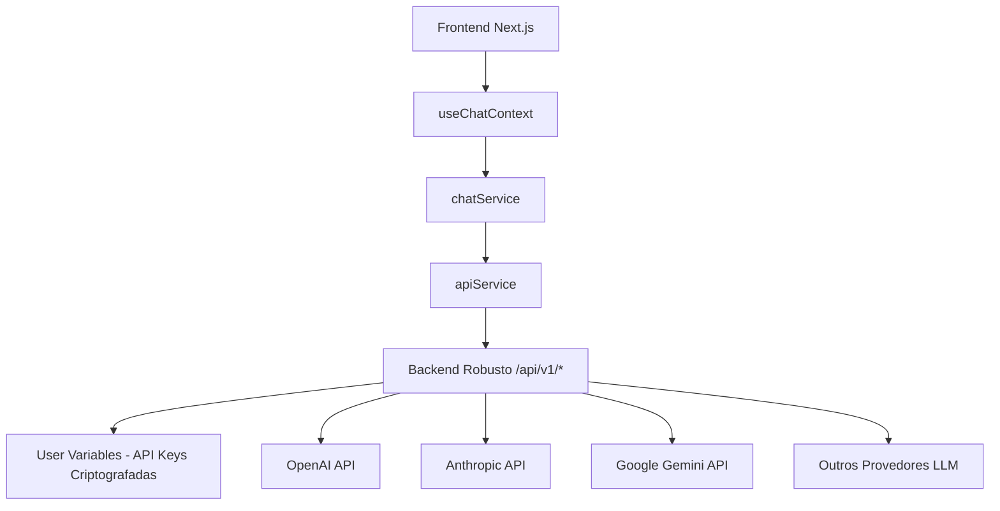

# 🔐 Configuração de API Keys - Arquitetura SaaS Correta

## 🏗️ **Arquitetura Implementada (CORRETA)**



## ✅ **Fluxo Correto Implementado:**

1. **Usuário** preenche API keys na página `/user-variables`
2. **Backend** salva keys criptografadas no banco por usuário
3. **Chat** → Frontend chama backend → Backend usa keys do usuário
4. **LLM Response** → Backend retorna resposta para frontend

## 🔧 **Configurações Necessárias**

### 1. **Variáveis de Ambiente (.env.local)**

```env
# Backend da SynapScale (seu backend robusto)
NEXT_PUBLIC_API_URL=http://localhost:8000
NEXT_PUBLIC_WS_URL=ws://localhost:8000

# Ambiente da aplicação
NEXT_PUBLIC_APP_ENV=development
```

### 2. **User Variables (Página /user-variables)**

O usuário deve configurar suas API keys na interface:

```bash
# API Keys dos Provedores LLM
OPENAI_API_KEY=sk-...
ANTHROPIC_API_KEY=sk-ant-...
GOOGLE_API_KEY=AIza...

# APIs de Ferramentas (opcionais)
TWITTER_API_KEY=...
LINKEDIN_API_KEY=...
INSTAGRAM_API_KEY=...
FACEBOOK_API_KEY=...
```

## 🛠️ **Como Funciona a Integração**

### Frontend (Next.js)
```typescript
// hooks/use-chat.tsx usa useChatContext()
const { sendMessage } = useChatContext();

// Envia mensagem através do contexto
await sendMessage("Olá, como você está?");
```

### Context Layer
```typescript
// context/chat-context.tsx usa chatService
const assistantMessage = await chatService.sendMessage(
  conversationId, 
  { content: message, attachments }
);
```

### Service Layer  
```typescript
// lib/services/chat.ts usa apiService
const response = await this.apiService.post(
  `/conversations/${conversationId}/messages`,
  messageData
);
```

### API Service
```typescript
// lib/api/service.ts faz chamada para backend
await fetch(`${API_BASE_URL}/api/v1/conversations/${id}/messages`, {
  method: 'POST',
  headers: { 'Authorization': `Bearer ${token}` },
  body: JSON.stringify(messageData)
});
```

### Backend (Seu Sistema Robusto)
```python
# Backend pega API keys do usuário do banco
user_variables = get_user_variables(user_id)
openai_key = decrypt(user_variables['OPENAI_API_KEY'])

# Faz chamada para LLM usando a key do usuário
response = openai.chat.completions.create(
    api_key=openai_key,
    model="gpt-4o",
    messages=[{"role": "user", "content": message}]
)
```

## 🚫 **O que FOI REMOVIDO (Incorreto)**

- ❌ API Route `/app/api/chat/route.ts` (implementação temporária)
- ❌ Chamadas diretas aos LLMs no frontend
- ❌ API keys expostas no Next.js

## ✅ **O que ESTÁ FUNCIONANDO (Correto)**

- ✅ Frontend chama apenas o backend do usuário
- ✅ Backend gerencia user variables (API keys criptografadas)
- ✅ Backend faz chamadas aos LLMs usando keys do usuário
- ✅ Arquitetura escalável e segura para SaaS

## 🔍 **Endpoints da API (Seu Backend)**

### Conversações
```bash
GET    /api/v1/conversations/              # Listar conversas
POST   /api/v1/conversations/              # Criar conversa
GET    /api/v1/conversations/{id}          # Obter conversa
DELETE /api/v1/conversations/{id}          # Deletar conversa
```

### Mensagens
```bash
GET  /api/v1/conversations/{id}/messages   # Listar mensagens
POST /api/v1/conversations/{id}/messages   # Enviar mensagem
```

### User Variables (API Keys)
```bash
GET    /api/v1/user-variables/             # Listar variáveis
POST   /api/v1/user-variables/             # Criar variável
PUT    /api/v1/user-variables/{id}         # Atualizar variável
DELETE /api/v1/user-variables/{id}         # Deletar variável
```

### LLM Generation
```bash
POST /api/v1/llm/generate                  # Gerar texto
POST /api/v1/llm/{provider}/generate       # Provedor específico
GET  /api/v1/llm/providers                 # Listar provedores
GET  /api/v1/llm/models                    # Listar modelos
```

## 🎯 **Próximos Passos**

1. **✅ Arquitetura Correta** - Já implementada
2. **⚙️ Configurar Backend** - Certifique-se que está rodando
3. **🔐 Configurar User Variables** - Usuário preenche API keys
4. **🧪 Testar Integração** - Enviar mensagens no chat
5. **📊 Monitorar** - Verificar logs e métricas

## 🐛 **Troubleshooting**

### Chat não funciona?
```bash
# 1. Verificar se backend está rodando
curl http://localhost:8000/health

# 2. Verificar autenticação
curl -H "Authorization: Bearer $TOKEN" http://localhost:8000/api/v1/auth/me

# 3. Verificar user variables
curl -H "Authorization: Bearer $TOKEN" http://localhost:8000/api/v1/user-variables/
```

### Erro de API Keys?
- Usuário deve preencher keys em `/user-variables`
- Backend deve descriptografar e usar keys do usuário
- Verificar logs do backend para erros de integração LLM

---

**✅ Esta é a arquitetura CORRETA para um SaaS profissional!** 🚀 