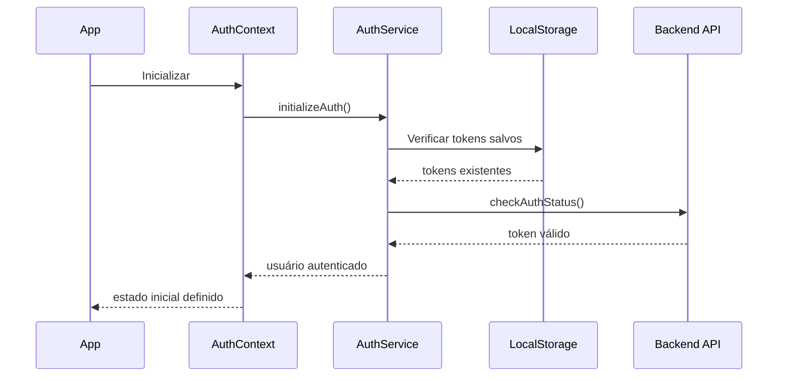
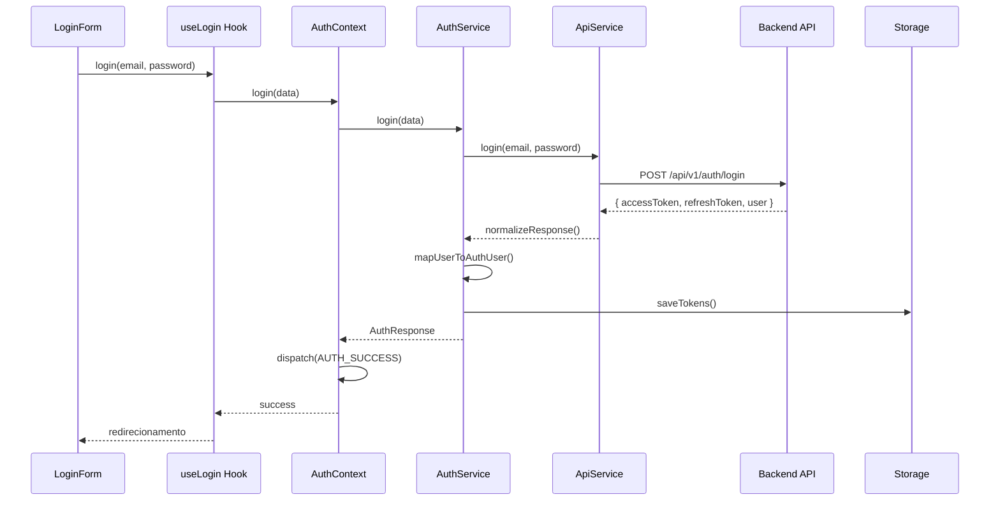
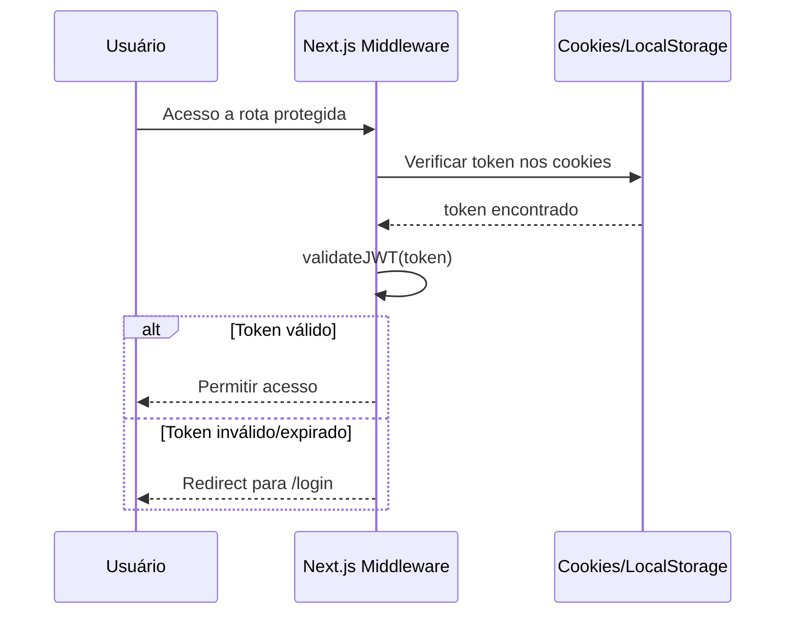

# 🔐 Guia Completo de Autenticação - SynapScale Frontend

## 📋 Índice

1. [Visão Geral da Arquitetura](#visão-geral-da-arquitetura)
2. [Estrutura de Arquivos](#estrutura-de-arquivos)
3. [Configuração e URLs](#configuração-e-urls)
4. [Fluxo de Autenticação](#fluxo-de-autenticação)
5. [Componentes Principais](#componentes-principais)
6. [Problemas Identificados e Soluções](#problemas-identificados-e-soluções)
7. [Debugging e Troubleshooting](#debugging-e-troubleshooting)
8. [Testes](#testes)
9. [Próximos Passos](#próximos-passos)

---

## 🏗️ Visão Geral da Arquitetura

### Padrão Arquitetural
A autenticação segue um padrão **Context + Services + Hooks** com camadas bem definidas:

```
┌─────────────────────────────────────┐
│             UI LAYER                │
│  ┌─────────────┐  ┌─────────────┐   │
│  │ Components  │  │   Hooks     │   │
│  └─────────────┘  └─────────────┘   │
└─────────────────────────────────────┘
┌─────────────────────────────────────┐
│           STATE LAYER               │
│  ┌─────────────────────────────┐    │
│  │       Auth Context          │    │
│  └─────────────────────────────┘    │
└─────────────────────────────────────┘
┌─────────────────────────────────────┐
│          SERVICE LAYER              │
│  ┌─────────────┐  ┌─────────────┐   │
│  │ Auth Service│  │ API Service │   │
│  └─────────────┘  └─────────────┘   │
└─────────────────────────────────────┘
┌─────────────────────────────────────┐
│         MIDDLEWARE LAYER            │
│  ┌─────────────────────────────┐    │
│  │      Next.js Middleware     │    │
│  └─────────────────────────────┘    │
└─────────────────────────────────────┘
```

### Princípios Fundamentais

1. **Single Source of Truth**: O `auth-context.tsx` é a única fonte da verdade para o estado de autenticação
2. **Separação de Responsabilidades**: Cada camada tem responsabilidades específicas
3. **Type Safety**: TypeScript em todos os níveis
4. **Persistência Robusta**: Múltiplas camadas de persistência e sincronização
5. **Error Handling**: Tratamento robusto de erros com recuperação automática

---

## 📁 Estrutura de Arquivos

### 🎯 Arquivos Principais

#### **1. Configuração Base**
```
lib/config.ts                    # 🔧 Configurações centrais, URLs e endpoints
.env                             # 🔐 Variáveis de ambiente (SECRETO)
```

#### **2. Tipos TypeScript**
```
lib/types/auth.ts                # 📝 Todas as interfaces e tipos de autenticação
```

#### **3. Contexto React**
```
context/auth-context.tsx         # 🏛️ Contexto principal com reducer e estado global
```

#### **4. Serviços**
```
lib/services/auth.ts             # 🎯 Serviço principal de autenticação
lib/api/service.ts               # 🌐 Serviço de API com configuração de endpoints
lib/services/auth-storage-sync.ts        # 💾 Sincronização de storage
lib/services/auth-tab-sync.ts            # 🔄 Sincronização entre abas
lib/services/auth-hydration.ts           # 💧 Hidratação do estado
lib/services/auth-storage-validator.ts   # ✅ Validação de dados no storage
lib/services/auth-cleanup-manager.ts     # 🧹 Limpeza de dados
lib/services/auth-services-registry.ts   # 📋 Registry de serviços
```

#### **5. Hooks**
```
hooks/useAuth.ts                 # 🪝 Hooks especializados (useLogin, useRegister, etc.)
hooks/useAuthLogger.ts           # 📊 Logging específico para autenticação
hooks/useAuthFeedback.ts         # 🔔 Feedback de UI para autenticação
```

#### **6. Componentes UI**
```
components/auth/login-form.tsx   # 📝 Formulário de login principal
components/auth/login-page.tsx   # 📄 Página de login
```

#### **7. Middleware**
```
middleware.ts                    # 🛡️ Proteção de rotas e validação JWT
```

#### **8. Testes**
```
tests/integration/login-flow.test.tsx           # 🧪 Teste do fluxo de login
tests/integration/logout-session.test.tsx       # 🧪 Teste de logout
tests/integration/authorization-permissions.test.tsx # 🧪 Teste de permissões
```

---

## ⚙️ Configuração e URLs

### 🔧 lib/config.ts - Configuração Central

#### **Sistema de URLs Normalizado**
```typescript
// Função que adiciona automaticamente /api/v1 para endpoints de aplicação
function normalizeApiBase(raw?: string): string {
  // Remove barras finais e adiciona /api/v1 automaticamente
  // Exceto se NEXT_PUBLIC_SKIP_API_V1=true
}

// Função para endpoints de sistema (sem /api/v1)
function getSystemApiBase(raw?: string): string {
  // Remove apenas barras finais, mantém URL base
}
```

#### **Endpoints de Sistema vs Aplicação**
```typescript
// Endpoints de SISTEMA (sem /api/v1)
const SYSTEM_ENDPOINTS = [
  '/',
  '/.identity',      // Health check de identidade
  '/current-url',    // Health check de URL
  '/health',         // Health check básico
  '/health/detailed',
  '/info'
];

// Endpoints de APLICAÇÃO (com /api/v1)
// Todos os outros endpoints automaticamente ganham /api/v1
```

#### **Configuração de Autenticação**
```typescript
auth: {
  tokenKey: 'synapsefrontend_auth_token',
  refreshTokenKey: 'synapsefrontend_refresh_token', 
  userKey: 'synapse_user',
  tokenExpirationBuffer: 300000, // 5 minutos antes de expirar
  autoRefresh: true,
  persistAuth: true,
  endpoints: {
    login: '/auth/login',
    register: '/auth/register',
    refresh: '/auth/refresh',
    logout: '/auth/logout',
    me: '/auth/me',
  }
}
```

### 🌐 Variáveis de Ambiente (.env)

#### **Variáveis Obrigatórias**
```bash
NEXT_PUBLIC_API_URL=https://synapse-backend-agents-jc.onrender.com
NEXT_PUBLIC_WS_URL=wss://synapse-backend-agents-jc.onrender.com
NEXT_PUBLIC_APP_ENV=production

# Chaves de storage (opcionais - têm valores padrão)
NEXT_PUBLIC_JWT_STORAGE_KEY=synapsefrontend_auth_token
NEXT_PUBLIC_REFRESH_TOKEN_KEY=synapsefrontend_refresh_token

# Flags especiais
NEXT_PUBLIC_SKIP_API_V1=false  # Se true, não adiciona /api/v1
```

---

## 🔄 Fluxo de Autenticação

### 1. **Inicialização da Aplicação**



### 2. **Processo de Login**



### 3. **Proteção de Rotas (Middleware)**



---

## 🔧 Componentes Principais

### 1. **AuthContext (context/auth-context.tsx)**

#### **Estado Global**
```typescript
interface AuthState {
  user: AuthUser | null
  token: string | null
  refreshToken: string | null
  isAuthenticated: boolean
  isLoading: boolean
  isInitialized: boolean
  error: string | null
}
```

#### **Reducer Actions**
```typescript
type AuthAction = 
  | { type: 'AUTH_START' }
  | { type: 'AUTH_SUCCESS'; payload: { user: AuthUser; tokens: AuthTokens } }
  | { type: 'AUTH_ERROR'; payload: string }
  | { type: 'AUTH_LOGOUT' }
  | { type: 'AUTH_REFRESH_TOKEN'; payload: AuthTokens }
  | { type: 'AUTH_UPDATE_USER'; payload: AuthUser }
  | { type: 'AUTH_CLEAR_ERROR' }
  | { type: 'AUTH_INITIALIZE' }
```

#### **Funcionalidades Principais**
- ✅ Inicialização automática
- ✅ Auto-refresh de tokens (a cada 60 segundos)
- ✅ Sincronização multi-tab
- ✅ Persistência em localStorage
- ✅ Tratamento robusto de erros

### 2. **AuthService (lib/services/auth.ts)**

#### **Responsabilidades**
```typescript
class AuthService {
  // Autenticação
  async login(data: LoginData): Promise<AuthResponse>
  async register(data: RegisterData): Promise<AuthResponse>
  async logout(): Promise<void>
  
  // Gerenciamento de tokens
  async refreshAccessToken(): Promise<AuthTokens>
  async checkAuthStatus(): Promise<boolean>
  isTokenExpiringSoon(): boolean
  
  // Persistência
  getStoredUser(): AuthUser | null
  getStoredToken(): string | null
  getStoredRefreshToken(): string | null
  clearAuthData(): void
  
  // Perfil
  async updateProfile(data: Partial<AuthUser>): Promise<AuthUser>
  async changePassword(oldPassword: string, newPassword: string): Promise<void>
}
```

#### **Normalização de Resposta**
```typescript
private normalizeAuthResponse(raw: any): AuthResponse {
  // Suporte para múltiplos formatos:
  // 1. Formato padrão: { tokens: {}, user: {} }
  // 2. Formato camelCase: { accessToken, refreshToken, user }
  // 3. Formato snake_case: { access_token, refresh_token, user }
}
```

### 3. **ApiService (lib/api/service.ts)**

#### **Configuração de URLs**
```typescript
constructor() {
  this.baseURL = API_BASE_URL;          // Com /api/v1
  this.systemBaseURL = SYSTEM_API_BASE_URL; // Sem /api/v1
}
```

#### **Sistema de Requests**
```typescript
async request<T>(endpoint: string, options?: ApiRequestOptions): Promise<T> {
  // Detecta automaticamente se é endpoint de sistema ou aplicação
  const baseURL = isSystemEndpoint(endpoint) ? this.systemBaseURL : this.baseURL;
  
  // Adiciona automaticamente Authorization header se não for skipAuth
  if (!options?.skipAuth && this.token) {
    headers.Authorization = `Bearer ${this.token}`;
  }
}
```

### 4. **Middleware (middleware.ts)**

#### **Validação JWT**
```typescript
function validateJWT(token: string): { isValid: boolean; payload?: any; error?: string } {
  // 1. Verifica estrutura (3 partes separadas por ponto)
  // 2. Decodifica payload
  // 3. Verifica expiração
  // 4. Retorna resultado da validação
}
```

#### **Proteção de Rotas**
```typescript
export function middleware(request: NextRequest) {
  const { pathname } = request.nextUrl
  
  // Permitir rotas públicas
  if (isPublicRoute(pathname)) return NextResponse.next()
  
  // Redirecionar autenticados tentando acessar rotas de auth
  if (isAuthRoute(pathname) && isUserAuthenticated) {
    return NextResponse.redirect(new URL('/chat', request.url))
  }
  
  // Redirecionar não-autenticados tentando acessar rotas protegidas
  if (isProtectedRoute(pathname) && !isUserAuthenticated) {
    return NextResponse.redirect(new URL('/login', request.url))
  }
}
```

---

## 🐛 Problemas Identificados e Soluções

### **Problema 1: Requests Contínuos para /.identity e /current-url**

#### **Sintoma**
```
INFO:synapse.middlewares.error_middleware:Request /.identity
INFO:synapse.middlewares.error_middleware:Request /current-url
```

#### **Causa Raiz**
Endpoints configurados como "sistema" mas não sendo chamados pelo frontend.

#### **Solução**
✅ **Identificação**: Os requests não vinham do frontend, mas de monitoramento externo (Render.com, uptime monitors)

### **Problema 2: Login Travado em "Carregando..."**

#### **Sintoma**
```typescript
// Página permanecia em loading infinito
<div>Carregando...</div>
```

#### **Causa Raiz**
```typescript
// initializeAuth estava comentado, então isInitialized nunca ficava true
// useEffect(() => {
//   initializeAuth()
// }, [])
```

#### **Solução**
```typescript
// ✅ Habilitado a inicialização
useEffect(() => {
  initializeAuth()
}, [])
```

### **Problema 3: Erro "Not Found" no Login**

#### **Sintoma**
```
ERROR: LoginForm - Erro durante autenticação: Not Found
```

#### **Causa Raiz**
```typescript
// ApiService usando URL crua em vez da normalizada
constructor() {
  this.baseURL = process.env.NEXT_PUBLIC_API_URL; // ❌ Sem /api/v1
}
```

#### **Tentativa de acesso**
```
❌ https://synapse-backend-agents-jc.onrender.com/auth/login (404)
✅ https://synapse-backend-agents-jc.onrender.com/api/v1/auth/login (200)
```

#### **Solução**
```typescript
// ✅ Usar configuração normalizada
constructor() {
  this.baseURL = API_BASE_URL;          // Com /api/v1
  this.systemBaseURL = SYSTEM_API_BASE_URL; // Sem /api/v1
}
```

### **Problema 4: Erro de Formato de Resposta**

#### **Sintoma**
```
ERROR: Formato de resposta de autenticação desconhecido: {
  "accessToken": "...",
  "refreshToken": null,
  "user": {...}
}
```

#### **Causa Raiz**
```typescript
// AuthService esperava snake_case, mas backend retorna camelCase
if (raw && raw.access_token && raw.refresh_token && raw.user) { // ❌
```

#### **Solução**
```typescript
// ✅ Suporte para ambos os formatos
private normalizeAuthResponse(raw: any): AuthResponse {
  // Formato camelCase (novo)
  if (raw && raw.accessToken && raw.user) {
    return {
      tokens: {
        accessToken: raw.accessToken,
        refreshToken: raw.refreshToken,
        tokenType: raw.tokenType || 'Bearer',
        expiresIn: raw.expiresIn || 0,
      },
      user: raw.user,
    }
  }
  
  // Formato snake_case (legacy)
  if (raw && raw.access_token && raw.refresh_token && raw.user) {
    return {
      tokens: {
        accessToken: raw.access_token,
        refreshToken: raw.refresh_token,
        tokenType: 'Bearer',
        expiresIn: raw.expires_in || 0,
      },
      user: raw.user,
    }
  }
}
```

### **Problema 5: Logger com Parâmetros Incorretos**

#### **Sintoma**
```
ERROR: [object Object] {}
```

#### **Causa Raiz**
```typescript
// Logger recebendo undefined como context
logger.error(message, undefined, {...}) // ❌
```

#### **Solução**
```typescript
// ✅ Context válido e tratamento robusto de erros
logger.error(
  `LoginForm - Erro durante autenticação: ${errorMsg}`,
  'AUTH',
  { formData: { email }, errorDetails }
)
```

---

## 🔍 Debugging e Troubleshooting

### **Logs de Debug Importantes**

#### **1. Inicialização**
```typescript
console.log('AuthContext - Restaurando sessão do usuário');
console.log('🔍 DEBUG AuthContext - Token:', storedToken?.substring(0, 20) + '...');
console.log('🔍 DEBUG AuthContext - ApiService autenticado:', apiService.isAuthenticated());
```

#### **2. Login**
```typescript
console.log('🔍 API Login - Iniciando login para email:', email);
console.log('📤 API Login - Dados sendo enviados:');
console.log('- URL:', `${this.baseURL}/auth/login`);
console.log('📥 API Login - Resposta recebida:', apiResponse);
```

#### **3. Middleware**
```typescript
console.log('🔍 Middleware - Verificando autenticação:', {
  pathname: request.nextUrl.pathname,
  isAuthenticated: isUserAuthenticated,
  hasToken: !!tokenFromCookie
});
```

### **Ferramentas de Debug**

#### **1. Verificar Estado do AuthContext**
```typescript
const { user, isAuthenticated, isInitialized, isLoading } = useAuth();
console.log('Estado Auth:', { user, isAuthenticated, isInitialized, isLoading });
```

#### **2. Verificar Tokens no Storage**
```typescript
console.log('Token:', localStorage.getItem('synapsefrontend_auth_token'));
console.log('Refresh Token:', localStorage.getItem('synapsefrontend_refresh_token'));
console.log('User:', localStorage.getItem('synapse_user'));
```

#### **3. Verificar URLs Geradas**
```typescript
import { getApiUrl, getSystemApiUrl } from '@/lib/config';
console.log('API URL:', getApiUrl('/auth/login'));
console.log('System URL:', getSystemApiUrl('/health'));
```

### **Comandos de Troubleshooting**

#### **1. Testar Conectividade com Backend**
```bash
# Health check
curl -s "https://synapse-backend-agents-jc.onrender.com/health"

# Testar endpoint de login
curl -s -X POST "https://synapse-backend-agents-jc.onrender.com/api/v1/auth/login" \
  -H "Content-Type: application/x-www-form-urlencoded" \
  -d "username=test@example.com&password=testpass"
```

#### **2. Verificar Variáveis de Ambiente**
```typescript
console.log('Environment Variables:', {
  API_URL: process.env.NEXT_PUBLIC_API_URL,
  WS_URL: process.env.NEXT_PUBLIC_WS_URL,
  APP_ENV: process.env.NEXT_PUBLIC_APP_ENV,
});
```

---

## 🧪 Testes

### **Estrutura de Testes**

#### **1. Testes de Integração**
```
tests/integration/
├── login-flow.test.tsx                    # Fluxo completo de login
├── logout-session.test.tsx                # Logout e limpeza de sessão
└── authorization-permissions.test.tsx     # Permissões e roles
```

#### **2. Testes Unitários (Recomendados)**
```
tests/unit/
├── auth-service.test.ts                   # AuthService
├── api-service.test.ts                    # ApiService  
├── auth-context.test.tsx                  # AuthContext
└── middleware.test.ts                     # Middleware
```

### **Comandos de Teste**
```bash
# Executar todos os testes
npm test

# Teste específico
npm test -- --testNamePattern="login flow"

# Testes com watch mode
npm run test:watch

# Testes E2E
npm run test:e2e
```

---

## 🔄 Próximos Passos

### **1. Melhorias de Segurança**
- [ ] Implementar refresh automático mais inteligente
- [ ] Adicionar rate limiting no frontend
- [ ] Implementar CSP (Content Security Policy) mais restritivo
- [ ] Adicionar detecção de sessões simultâneas

### **2. Monitoramento e Observabilidade**
- [ ] Implementar métricas de autenticação
- [ ] Adicionar alertas para falhas de login
- [ ] Dashboard de saúde da autenticação
- [ ] Logs estruturados para auditoria

### **3. Funcionalidades Avançadas**
- [ ] Login social (Google, GitHub) - já tem componentes
- [ ] 2FA (Two-Factor Authentication)
- [ ] Single Sign-On (SSO)
- [ ] Gestão de sessões múltiplas

### **4. Performance**
- [ ] Lazy loading dos serviços de auth
- [ ] Cache inteligente de validações
- [ ] Otimização do bundle de autenticação
- [ ] Service Worker para auth offline

### **5. Testes e Qualidade**
- [ ] Cobertura de testes 100%
- [ ] Testes de carga para auth
- [ ] Testes de segurança automatizados
- [ ] Validação contínua dos endpoints

---

## 📞 Suporte e Manutenção

### **Pontos de Contato**
- **Problemas de Login**: Verificar logs do AuthService e ApiService
- **Problemas de Routing**: Verificar middleware.ts e proteção de rotas
- **Problemas de Storage**: Verificar auth-storage-sync.ts
- **Problemas de UI**: Verificar login-form.tsx e componentes auth

### **Checklist de Health Check**
- [ ] Backend respondendo em `/health`
- [ ] Endpoint `/api/v1/auth/login` funcionando
- [ ] Variáveis de ambiente configuradas
- [ ] Tokens sendo salvos no localStorage
- [ ] Middleware protegendo rotas corretamente
- [ ] AuthContext inicializando corretamente

---

**✅ Status**: Autenticação funcionando corretamente  
**📅 Última atualização**: 04/01/2025  
**👨‍💻 Responsável**: Sistema de autenticação robusto e completo  

---

*Este documento deve ser atualizado sempre que houver mudanças na arquitetura de autenticação.*
