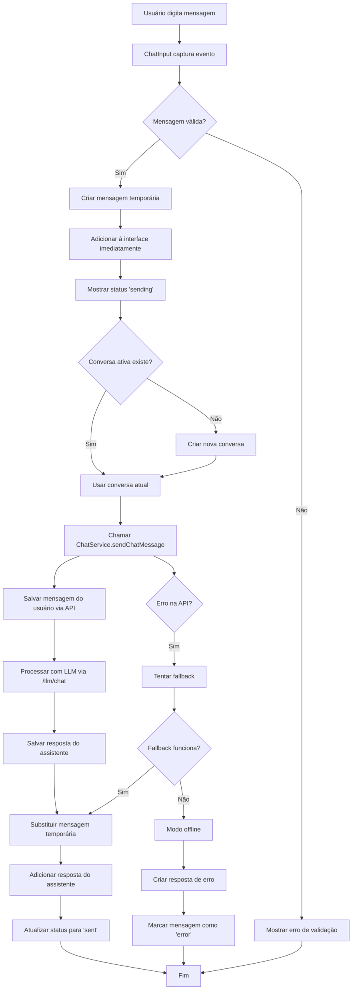
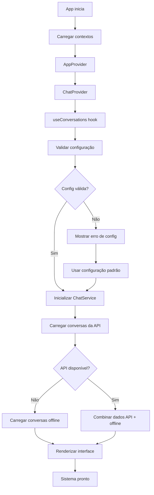
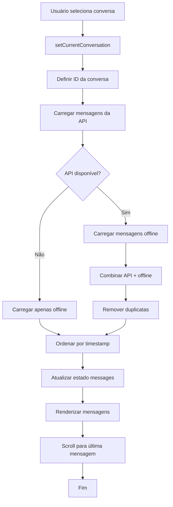
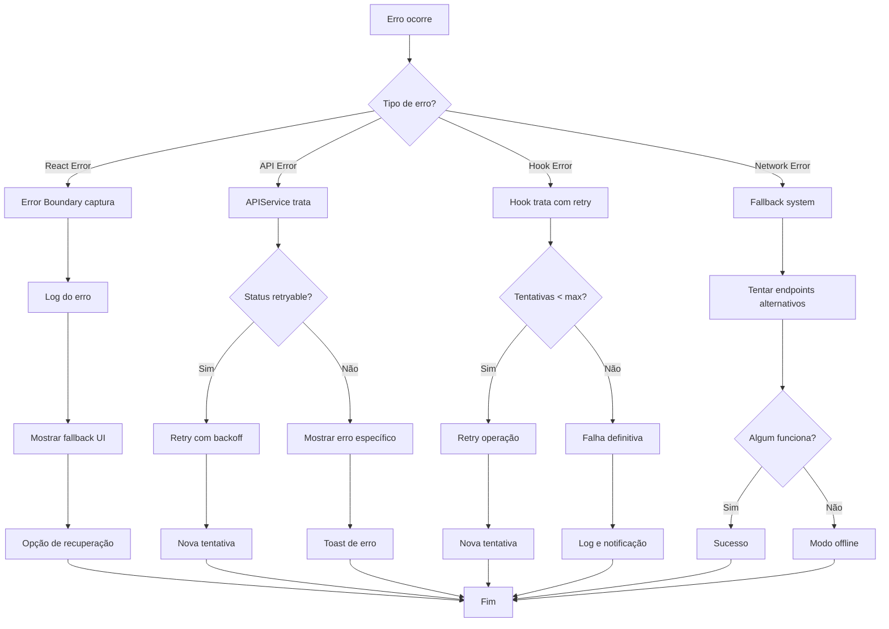
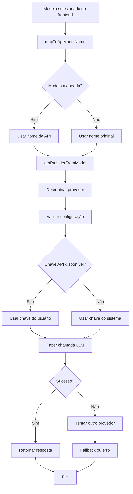
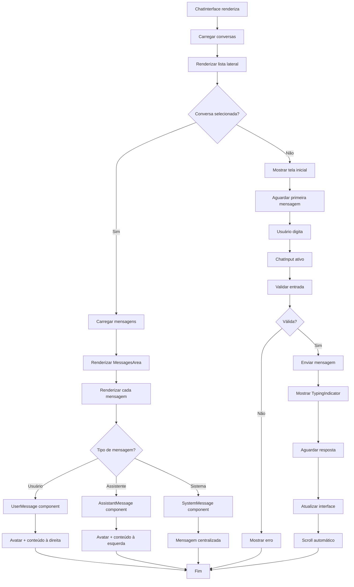
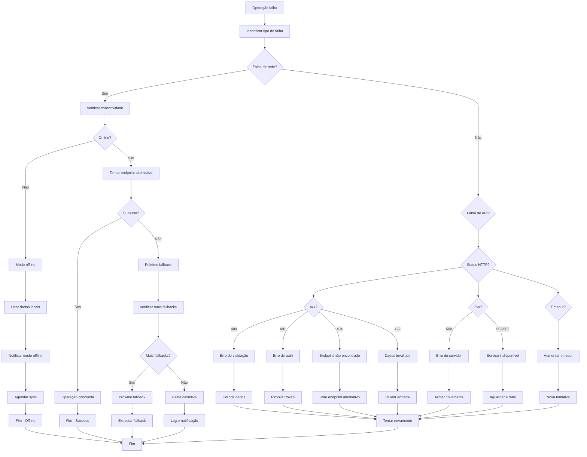
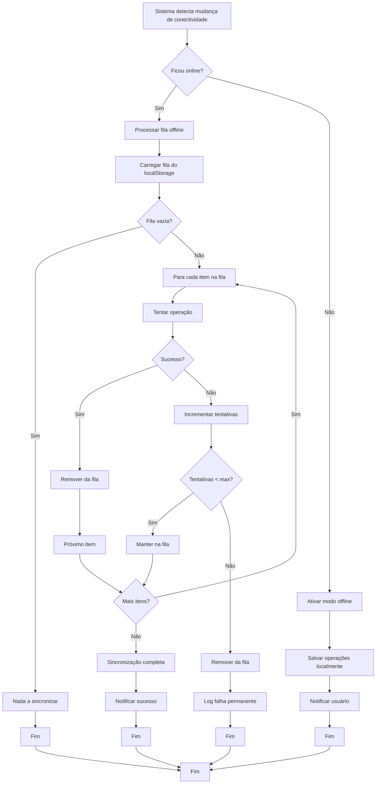
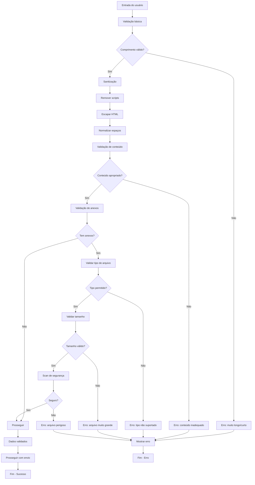

# Diagramas de Fluxo - Sistema de Chat

## Visão Geral

Este documento apresenta os diagramas de fluxo que ilustram o funcionamento completo do sistema de chat, desde a interface do usuário até as chamadas de API e tratamento de erros.

## 1. Fluxo Principal de Envio de Mensagem



## 2. Fluxo de Inicialização do Sistema



## 3. Fluxo de Carregamento de Conversa



## 4. Fluxo de Tratamento de Erros



## 5. Fluxo de Mapeamento de Modelos



## 6. Fluxo de Persistência Híbrida

```mermaid
graph TD
    A[Dados precisam ser salvos] --> B{Tipo de dados?}
    B -->|Conversa| C[Salvar na API]
    B -->|Mensagem usuário| D[Salvar na API]
    B -->|Mensagem assistente| E[Salvar no localStorage]
    
    C --> F{API disponível?}
    D --> G{API disponível?}
    E --> H[localStorage.setItem]
    
    F -->|Sim| I[POST /conversations/]
    F -->|Não| J[Salvar offline]
    G -->|Sim| K[POST /conversations/{id}/messages/]
    G -->|Não| L[Salvar offline]
    
    I --> M[Salvar backup offline]
    J --> N[Adicionar à fila de sync]
    K --> O[Salvar backup offline]
    L --> P[Adicionar à fila de sync]
    H --> Q[Dados salvos localmente]
    
    M --> R[Dados sincronizados]
    N --> S[Aguardar conexão]
    O --> R
    P --> S
    Q --> T[Fim]
    R --> T
    S --> U[Tentar sync quando online]
    U --> T
```

## 7. Fluxo de Interface do Usuário



## 8. Fluxo de Fallback e Recuperação



## 9. Fluxo de Sincronização Online/Offline



## 10. Fluxo de Validação e Sanitização



## Legenda dos Diagramas

### Símbolos Utilizados
- **Retângulo**: Processo ou ação
- **Losango**: Decisão ou condição
- **Círculo**: Início ou fim
- **Hexágono**: Preparação ou configuração
- **Paralelogramo**: Entrada ou saída de dados

### Cores e Significados
- **Verde**: Fluxo de sucesso
- **Vermelho**: Fluxo de erro
- **Azul**: Processo normal
- **Amarelo**: Decisão ou validação
- **Roxo**: Fallback ou recuperação

### Convenções
- Setas sólidas: Fluxo principal
- Setas tracejadas: Fluxo alternativo
- Texto em negrito: Componentes principais
- Texto em itálico: Estados ou condições
``` 