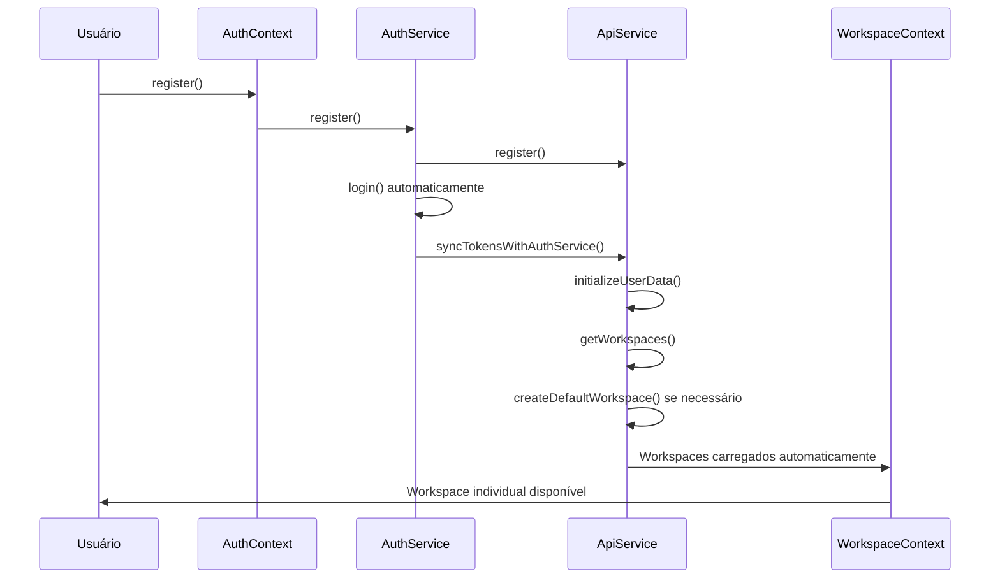
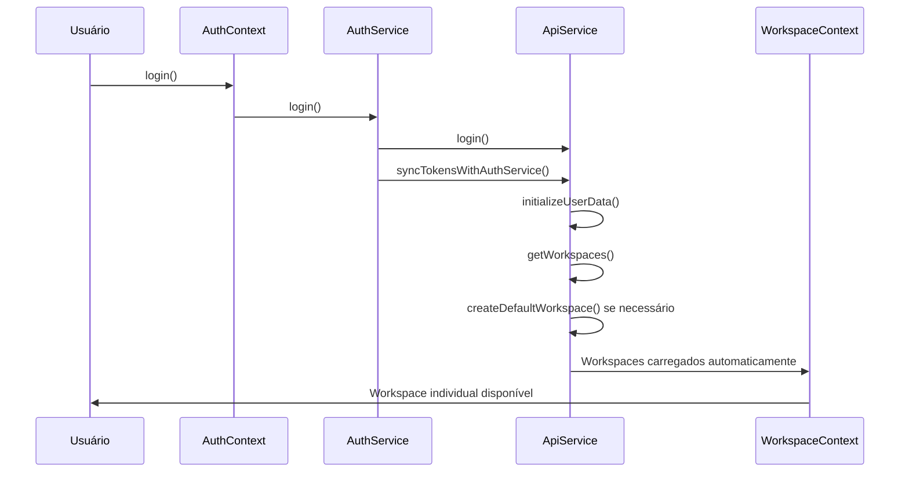

# 🏢 Sistema de Workspace Individual Automático

## 📋 **Visão Geral**

O sistema garante que **todo usuário sempre tenha um workspace ativo**. Quando um usuário se cadastra ou faz login, automaticamente um workspace individual é criado se não existir nenhum.

## 🔄 **Fluxo Automático**

### 1. **Registro de Usuário**


### 2. **Login de Usuário**


## 🏗️ **Componentes do Sistema**

### **1. ApiService** (`lib/api/service.ts`)
**Responsabilidade**: Criação automática de workspace padrão

```typescript
// Chamado automaticamente após login/token sync
private async initializeUserData() {
  const workspaces = await this.getWorkspaces()
  
  if (workspaces.length === 0) {
    const defaultWorkspace = await this.createDefaultWorkspace()
    if (defaultWorkspace) {
      await this.createDefaultProject(defaultWorkspace.id)
    }
  }
}

// Cria workspace individual
private async createDefaultWorkspace(): Promise<Workspace | null> {
  const user = await this.getCurrentUser()
  const workspaceName = `Workspace de ${user.full_name || user.email}`
  
  return await this.createWorkspace({
    name: workspaceName,
    description: 'Workspace padrão criado automaticamente',
    is_public: false,
    // ... outras configurações
  })
}
```

### **2. WorkspaceContext** (`context/workspace-context.tsx`)
**Responsabilidade**: Gerenciamento de estado de workspaces

```typescript
// Inicializa automaticamente após login
const initializeWorkspaces = useCallback(async () => {
  const workspaces = await apiService.getWorkspaces()
  
  if (workspaces.length === 0) {
    // Aguarda criação automática pelo ApiService
    await new Promise(resolve => setTimeout(resolve, 2000))
    const newWorkspaces = await apiService.getWorkspaces()
    
    if (newWorkspaces.length === 0) {
      // Força criação se necessário
      await createDefaultWorkspace()
    }
  }
  
  // Define workspace atual
  const currentWorkspace = workspaces[0] || newWorkspaces[0]
  dispatch({ type: 'WORKSPACE_SUCCESS', payload: { workspaces, current: currentWorkspace } })
}, [authContext.user])
```

### **3. WorkspaceSelector** (`components/workspace/workspace-selector.tsx`)
**Responsabilidade**: Interface para visualizar e trocar workspace

```typescript
export function WorkspaceSelector() {
  const { setCurrentWorkspace, getWorkspaces } = useWorkspace()
  const currentWorkspace = useCurrentWorkspace()
  
  // Permite trocar entre workspaces
  const handleWorkspaceSelect = (workspace: Workspace) => {
    setCurrentWorkspace(workspace)
    localStorage.setItem('current_workspace_id', workspace.id)
  }
}
```

## 🔧 **Configuração Automática**

### **Workspace Padrão Criado:**
- **Nome**: `"Workspace de [Nome do Usuário]"`
- **Descrição**: `"Workspace padrão criado automaticamente"`
- **Privacidade**: Privado (`is_public: false`)
- **Configurações**:
  - `max_members: 10`
  - `max_projects: 100`
  - `max_storage_mb: 1000`
  - `enable_real_time_editing: true`
  - `enable_comments: true`
  - `enable_chat: true`
  - `enable_video_calls: false`

### **Projeto Padrão Criado:**
- **Nome**: `"Meu Primeiro Projeto"`
- **Descrição**: `"Projeto padrão criado automaticamente para começar"`
- **Status**: `active`

## 🎯 **Pontos de Integração**

### **1. Layout Principal** (`app/layout.tsx`)
```typescript
<AuthProvider>
  <WorkspaceProvider>  {/* ← Integrado aqui */}
    <PlanProvider>
      {/* ... outros providers */}
    </PlanProvider>
  </WorkspaceProvider>
</AuthProvider>
```

### **2. Sidebar** (`components/sidebar/index.tsx`)
```typescript
{/* Seletor de Workspace */}
<div className="border-b px-4 py-3">
  <WorkspaceSelector className="w-full" />
</div>
```

### **3. Página Team** (`app/team/page.tsx`)
```typescript
// Usa dados do WorkspaceContext
const { state: workspaceState } = useWorkspace()
const currentWorkspace = useCurrentWorkspace()
const workspaces = workspaceState.workspaces
```

## 🔄 **Estados do Sistema**

### **Loading States**
- `workspaceState.isLoading`: Carregando workspaces
- `workspaceState.isInitialized`: Sistema inicializado
- `authContext.isInitialized`: Autenticação inicializada

### **Error Handling**
- `workspaceState.error`: Erros de workspace
- Fallbacks automáticos para criação de workspace
- Retry automático após 2 segundos

### **Persistência**
- `localStorage.setItem('current_workspace_id', workspace.id)`: Workspace atual salvo
- Restauração automática do workspace salvo no próximo login

## ✅ **Garantias do Sistema**

### **1. Usuário Sempre Tem Workspace**
- ✅ Criação automática no registro
- ✅ Criação automática no login (se não existir)
- ✅ Verificação dupla no WorkspaceContext
- ✅ Fallback manual se API falhar

### **2. Workspace Sempre Ativo**
- ✅ Primeiro workspace definido como atual automaticamente
- ✅ Workspace salvo persistido no localStorage
- ✅ Restauração automática na próxima sessão

### **3. Interface Sempre Funcional**
- ✅ Loading states durante inicialização
- ✅ Fallbacks visuais se não houver workspace
- ✅ Seletor de workspace sempre visível na sidebar

## 🔍 **Logs de Debug**

O sistema produz logs detalhados para debug:

```
🔄 Inicializando dados do usuário...
📋 Workspaces encontrados: 0
🏗️ Criando workspace padrão...
✅ Workspace padrão criado com sucesso
🏗️ Criando projeto padrão...
✅ Projeto padrão criado com sucesso

🏢 Inicializando workspaces do usuário...
📋 Workspaces encontrados: 1
✅ Workspace atual definido: Workspace de João
```

## 🚀 **Uso em Produção**

### **Para Desenvolvedores:**
```typescript
// Sempre disponível em qualquer componente
import { useCurrentWorkspace, useWorkspace } from '@/context/workspace-context'

function MyComponent() {
  const currentWorkspace = useCurrentWorkspace() // Nunca null após inicialização
  const { state, setCurrentWorkspace } = useWorkspace()
  
  // Usar workspace atual
  console.log('Workspace atual:', currentWorkspace?.name)
}
```

### **Para Usuários:**
1. **Registro**: Workspace criado automaticamente
2. **Login**: Workspace disponível imediatamente
3. **Navegação**: Workspace sempre visível na sidebar
4. **Troca**: Seletor de workspace permite mudança fácil

## 🔧 **Manutenção**

### **Monitoramento:**
- Verificar logs de criação de workspace
- Monitorar erros no `workspaceState.error`
- Acompanhar tempo de inicialização

### **Troubleshooting:**
- Se workspace não aparecer: Verificar logs do ApiService
- Se seletor não funcionar: Verificar WorkspaceContext no layout
- Se dados não persistirem: Verificar localStorage

## 📈 **Próximos Passos**

1. **Métricas**: Adicionar analytics de uso de workspace
2. **Otimização**: Cache de workspaces para melhor performance
3. **Colaboração**: Sistema de convites e compartilhamento
4. **Templates**: Workspaces pré-configurados por tipo de projeto 