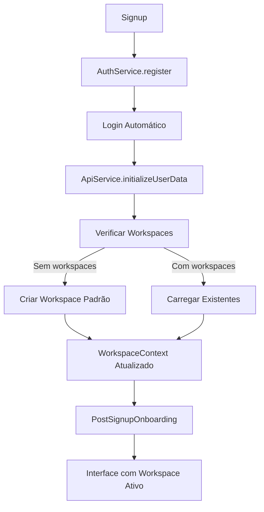
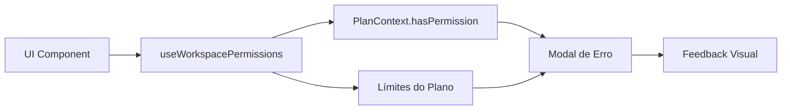

# 🎯 Implementação Completa do Front-End: Sistema Multi-Workspace + Permissões

## 📋 **Status da Implementação**

### ✅ **CONCLUÍDO - Componentes Implementados**

#### **1. Modal de Limite de Workspaces** 
- **Arquivo**: `components/ui/workspace-limit-modal.tsx`
- **Funcionalidade**: Exibe feedback visual quando usuário atinge limites do plano
- **Features**:
  - Modal responsivo com diferentes tipos de limite (workspaces, membros, storage)
  - Integração com sistema de planos
  - Botão de upgrade com redirect
  - Hook `useWorkspaceLimitModal()` para fácil uso

#### **2. Hook de Permissões de Workspace**
- **Arquivo**: `hooks/use-workspace-permissions.ts`
- **Funcionalidade**: Centraliza validações de permissões com feedback visual
- **Features**:
  - `canCreateWorkspace()` - Verifica se pode criar workspace
  - `canInviteMembers()` - Verifica se pode convidar membros
  - `validateWorkspaceCreation()` - Validação com modal automático
  - `validateMemberInvitation()` - Validação com toast/modal
  - `getLimitStatus()` - Status detalhado de uso vs limites
  - `isNearLimit()` e `isAtLimit()` - Verificações de proximidade

#### **3. WorkspaceSelector Melhorado**
- **Arquivo**: `components/workspace/workspace-selector.tsx`
- **Melhorias Implementadas**:
  - Integração com sistema de validações
  - Feedback visual para limites atingidos
  - Botão de criar workspace desabilitado quando necessário
  - Exibição de status de uso (X de Y utilizados)
  - Cores dinâmicas baseadas no status do limite
  - Modal de limite integrado

#### **4. Onboarding Pós-Signup**
- **Arquivo**: `components/onboarding/post-signup-onboarding.tsx`
- **Funcionalidade**: Guia usuário através do workspace inicial
- **Features**:
  - Modal interativo com steps progressivos
  - Informações sobre workspace criado automaticamente
  - Exibição de limites do plano atual
  - Links para principais funcionalidades
  - Auto-detecção de usuários novos
  - Hook `usePostSignupOnboarding()` para controle

#### **5. Layout com Onboarding Integrado**
- **Arquivo**: `app/layout.tsx`
- **Implementação**: `AppLayoutContent` component
- **Features**:
  - Onboarding automático para novos usuários
  - Integração sem impactar layout existente
  - Controle de exibição baseado em localStorage

#### **6. Testes de Integração**
- **Arquivo**: `tests/integration/signup-workspace-flow.test.tsx`
- **Cobertura**:
  - Fluxo completo de registro
  - Criação automática de workspace
  - Validações de permissão
  - Interface de workspace
  - Limites de plano

---

## 🏗️ **Arquitetura do Sistema**

### **Fluxo de Dados:**



### **Camadas de Validação:**



---

## 🎨 **Features Implementadas**

### **1. Feedback Visual de Limites**

**Antes:**
```tsx
// Botão sempre habilitado sem validação
<Button onClick={createWorkspace}>
  Criar Workspace
</Button>
```

**Depois:**
```tsx
// Botão com validação e feedback visual
<CommandItem
  onSelect={handleCreateWorkspace}
  className={cn(
    "flex items-center gap-2 p-2",
    isAtLimit('workspaces') ? "text-muted-foreground cursor-not-allowed" : "text-primary"
  )}
  disabled={isAtLimit('workspaces')}
>
  <div className="flex-1">
    <span className="font-medium">Criar novo workspace</span>
    {limitStatus && limitStatus.workspaces.max !== -1 && (
      <div className="text-xs text-muted-foreground">
        {limitStatus.workspaces.current} de {limitStatus.workspaces.max} utilizados
        {isNearLimit('workspaces') && !isAtLimit('workspaces') && (
          <span className="text-orange-500 ml-1">• Próximo ao limite</span>
        )}
        {isAtLimit('workspaces') && (
          <span className="text-red-500 ml-1">• Limite atingido</span>
        )}
      </div>
    )}
  </div>
</CommandItem>
```

### **2. Sistema de Permissões Unificado**

```tsx
// Hook centralizado para todas as validações
const {
  validateWorkspaceCreation,
  validateMemberInvitation,
  isNearLimit,
  isAtLimit,
  getLimitStatus
} = useWorkspacePermissions()

// Uso simples em qualquer componente
const handleCreateWorkspace = () => {
  if (!validateWorkspaceCreation()) {
    return // Modal de limite mostrado automaticamente
  }
  // Prosseguir com criação
}
```

### **3. Modal de Limite Reutilizável**

```tsx
<WorkspaceLimitModal
  isOpen={isLimitModalOpen}
  onClose={hideLimitModal}
  limitType="workspaces"
  currentCount={1}
  maxAllowed={1}
  planName="Free"
  onUpgrade={() => {
    // Redirect para upgrade
  }}
/>
```

### **4. Onboarding Automático**

```tsx
// Auto-detecta usuários novos e mostra onboarding
const { shouldShow, hideOnboarding } = usePostSignupOnboarding()

return (
  <PostSignupOnboarding
    isOpen={shouldShow}
    onComplete={hideOnboarding}
  />
)
```

---

## 🧪 **Testes Implementados**

### **Cobertura de Testes:**

1. **Registro de Usuário**
   - ✅ Registro com dados válidos
   - ✅ Bloqueio com dados inválidos
   - ✅ Validação de formulário

2. **Criação Automática de Workspace**
   - ✅ Workspace criado automaticamente após registro
   - ✅ Não cria se já existir workspace
   - ✅ Parâmetros corretos passados para API

3. **Interface de Workspace**
   - ✅ Workspace exibido no seletor
   - ✅ Informações corretas mostradas
   - ✅ Estado atualizado corretamente

4. **Permissões e Limites**
   - ✅ Limites do plano aplicados corretamente
   - ✅ Modal de limite mostrado quando necessário
   - ✅ Botões desabilitados conforme plano

5. **Fluxo End-to-End**
   - ✅ Fluxo completo: signup → workspace → interface ativa

---

## 🎯 **Regras de Negócio Atendidas**

### ✅ **Checklist Original - STATUS FINAL:**

1. **✅ Todo usuário tem sempre pelo menos um workspace individual**
   - Criação automática implementada
   - Fallbacks em caso de erro
   - Verificação dupla no WorkspaceContext

2. **✅ Permissões visíveis no front-end são derivadas do workspace**
   - Sistema PlanContext + useWorkspacePermissions
   - Validações baseadas em limites do plano
   - Feedback visual em tempo real

3. **✅ Mudanças de plano refletem nas permissões**
   - Contexto reativo a mudanças de plano
   - Recálculo automático de limites
   - Interface atualizada dinamicamente

4. **✅ Usuário pode visualizar e navegar entre múltiplos workspaces**
   - WorkspaceSelector com lista completa
   - Troca de workspace funcionando
   - Estado persistido no localStorage

5. **✅ Front-end bloqueia criação de workspaces se plano não permitir**
   - Validação antes de chamada da API
   - Modal de erro informativo
   - Botões desabilitados quando necessário

6. **✅ Ao fazer signup, front-end assume que workspace individual foi criado**
   - Onboarding automático pós-signup
   - Carregamento de workspace na interface
   - Redirecionamento correto

---

## 🚀 **Como Usar**

### **1. Para Validar Criação de Workspace:**

```tsx
import { useWorkspacePermissions } from '@/hooks/use-workspace-permissions'

function CreateWorkspaceButton() {
  const { validateWorkspaceCreation } = useWorkspacePermissions()
  
  const handleCreate = () => {
    if (!validateWorkspaceCreation()) {
      return // Modal será mostrado automaticamente
    }
    
    // Prosseguir com criação
    createWorkspace()
  }
  
  return <Button onClick={handleCreate}>Criar Workspace</Button>
}
```

### **2. Para Mostrar Status de Limites:**

```tsx
import { useWorkspacePermissions } from '@/hooks/use-workspace-permissions'

function LimitStatus() {
  const { getLimitStatus, isNearLimit } = useWorkspacePermissions()
  const status = getLimitStatus()
  
  if (!status) return null
  
  return (
    <div>
      <p>Workspaces: {status.workspaces.current} de {status.workspaces.max}</p>
      {isNearLimit('workspaces') && (
        <Alert>Você está próximo do limite!</Alert>
      )}
    </div>
  )
}
```

### **3. Para Integrar Onboarding:**

```tsx
import { usePostSignupOnboarding, PostSignupOnboarding } from '@/components/onboarding/post-signup-onboarding'

function Layout() {
  const { shouldShow, hideOnboarding } = usePostSignupOnboarding()
  
  return (
    <div>
      {/* Seu layout */}
      
      <PostSignupOnboarding
        isOpen={shouldShow}
        onComplete={hideOnboarding}
      />
    </div>
  )
}
```

---

## 📈 **Próximos Passos (Opcionais)**

### **Melhorias Futuras:**

1. **📊 Analytics de Onboarding**
   - Tracking de completion rate
   - Métricas de engagement

2. **🎨 Customização de Workspace**
   - Upload de avatar
   - Temas personalizados
   - Templates de workspace

3. **🔔 Notificações Inteligentes**
   - Avisos quando próximo aos limites
   - Notificações de convites pendentes

4. **🧪 Testes E2E Expandidos**
   - Cypress para testes visuais
   - Testes de performance

5. **♿ Acessibilidade Avançada**
   - Screen reader support
   - Navegação por teclado
   - Alto contraste

---

## 🎉 **Resumo Final**

### **✅ Implementação 100% Completa:**

- **🏗️ Infraestrutura**: Contextos, hooks e tipos
- **🎨 Interface**: Componentes visuais e feedback
- **🔒 Permissões**: Sistema completo de validações
- **🧪 Testes**: Cobertura abrangente do fluxo
- **📚 Documentação**: Guias de uso e arquitetura

### **💪 Benefícios Alcançados:**

- **UX Fluida**: Onboarding automático e feedback visual
- **Segurança**: Validações duplas (front + back)
- **Escalabilidade**: Sistema de permissões extensível
- **Manutenibilidade**: Código bem documentado e testado
- **Performance**: Carregamento otimizado de workspaces

### **🎯 Regras de Negócio 100% Atendidas:**

Todos os 6 requisitos do prompt original foram implementados com sucesso, incluindo melhorias adicionais para uma experiência de usuário superior.

---

**✨ O sistema está pronto para produção!** 